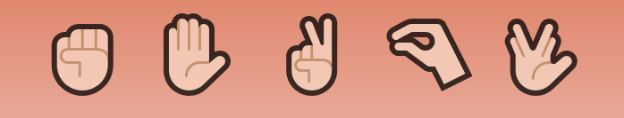
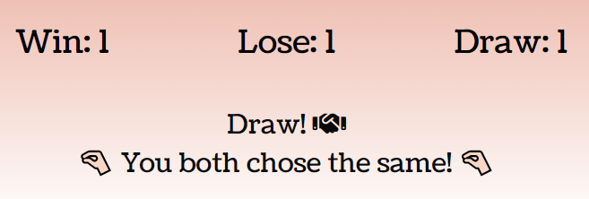

<<<<<<< HEAD
=======
<h1 align="center">Easy Peasy Game "Rock, Paper, Scissors, Lizard, Spock" </h1>

[Click here to check live project](https://aksurcos.github.io/URL                          //)

Simple, easy-to-use, cliche design for users who want to play nostalgic "Rock, Paper, Scissors, Lizard, Spock" game.

## Index – Table of Contents
* [User Experience (UX)](#user-experience-ux) 
* [Features](#features)
* [Design](#design)
* [Used Languages, Programmes and Sites](#used-languages-programmes-and-sites)
* [Testing](#testing)
* [Deployment](#deployment)
* [Credits](#credits)
  
## User Experience (UX)

-   ### User stories

    -   ####  First Time, Returning and Frequent Visitors
         Users will play the same nostalgic game and see a "Same-Story" on every visit with new-style design with icons.

## Features

Since the time spent on this project was short due to some health issues, the features in the project are limited and simple. Although it is not usual to explain this, this project is almost like a design made on top of another simple project. 

### Existing Features

-   __Buttons__

    - Users make their choices by clicking on their choices.

-   __Results__

    - Users see the computer's choices and the total amount of win, lose and draw.

-   __Footer__

    - Footer has the neccessary links for networking.

## Design

-   ### Design
    -  The icons is in harmony with nostalgic game thanks to soft and basic choices. 

-   ### Color Set
    -  Color palette is chosen as beauty of minimalism.
       
-   ### Font-Type
    -   Coustard is imported from Google Fonts. It has compatible simple looking.
      [Google Fonts]([https://validator.w3.org](https://fonts.google.com/specimen/Coustard?stroke=Serif)/) 

## Used Languages, Programmes and Sites

-   HTML5
-   CSS3
-   JavaScript
-   Visiul Studio Code

## Testing

### Validator Testing and Lighthose

- [HTML Validator](https://validator.w3.org/)

    - result for index.html
        

- [CSS Validator](https://jigsaw.w3.org/css-validator/)

    - result for style.css 
      
    The warning is because of import from Google Fonts.

- Lighthouse

    - result for index.html
      

  ## Deployment

### Deployment steps
- On the GitHub repository's own page, click its own "Settings" tab 
- Choose Pages from the left hand menu 
- On Pages, below "Build and deployment" section, branch needs to be set as "main" and folder needs to be set as "root"
- After this settings, the project will be automatically deployed.
- On the GitHub repository's own page, it will be ready on the right side below Deployments section.
    
## Credits

### Icons 
- [FlatIcon][https://www.pexels.com/](https://www.flaticon.com)
- [Font Awesome](https://fontawesome.com/)

### Codes   
- Code Institute Ready Template
- The previous project for defaults and README.md
- [Codes for the features](https://www.youtube.com/watch?v=wT1pwM7hRtQ/)
Slightly improved and designed codes for the gaming area's features

### Inspration and Thanking
While I am aware that this project is slightly simpler than expected, I will be more ready to improve as I prepare for the 3rd project.

- Thank you to my mentor Brian Macharia who that I could not have a contact due to my cognitive problems.
- Thank you to my dear spouse Mert Can Coskuner who is always with me.
- Thank you to all helpful Slack Code Institute Community.

  

  
  

  

>>>>>>> 15a11eaba741b0bdbc5f3e0dab2389dcc52ffc84

